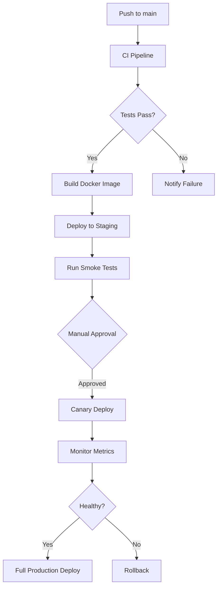

# HAL9 CI/CD Pipeline Documentation

## Overview

The HAL9 project uses GitHub Actions for continuous integration and deployment. The pipeline consists of multiple workflows that ensure code quality, security, and reliable deployments.

## Workflows

### 1. CI - Continuous Integration (`ci.yml`)

**Triggers**: Push to main/develop, Pull requests to main

**Jobs**:
- **Lint**: Rust formatting and clippy checks
- **Test**: Unit tests on multiple OS and Rust versions
- **Build**: Cross-platform builds (Linux, macOS, Windows)
- **Integration Test**: Full integration tests with PostgreSQL and Redis
- **Security**: Cargo audit for vulnerabilities
- **Coverage**: Code coverage with tarpaulin

### 2. CD - Continuous Deployment (`cd.yml`)

**Triggers**: Git tags (v*), Manual workflow dispatch

**Jobs**:
- **Build and Push**: Multi-arch Docker images to GitHub Container Registry
- **Deploy Staging**: Automatic deployment to staging environment
- **Deploy Production**: Canary deployment with gradual rollout

**Features**:
- Canary deployments (10% → 100%)
- Automatic rollback on failure
- Database backup before production deploy
- Slack notifications

### 3. Release Management (`release.yml`)

**Triggers**: Push to main, Manual workflow dispatch

**Jobs**:
- **Release**: Automated version bumping and changelog generation
- **Build Binaries**: Cross-platform binary builds

**Features**:
- Semantic versioning based on commit messages
- Automatic changelog generation with git-cliff
- GitHub Release creation
- Binary artifacts for all platforms

### 4. Security Scanning (`security.yml`)

**Triggers**: Push, Pull requests, Weekly schedule

**Jobs**:
- **Audit**: Rust dependency vulnerability scanning
- **Dependency Check**: License and dependency analysis
- **Docker Scan**: Container vulnerability scanning with Trivy
- **SAST**: Static code analysis with CodeQL
- **Secrets Scan**: Detect leaked secrets with TruffleHog and Gitleaks
- **License Check**: Ensure license compliance
- **SBOM**: Generate Software Bill of Materials

### 5. Performance Benchmarks (`benchmark.yml`)

**Triggers**: Push to main, Pull requests

**Jobs**:
- **Benchmark**: Rust micro-benchmarks
- **Neuron Benchmark**: Self-organization performance tests
- **Load Test**: k6 load testing with staged ramp-up

**Features**:
- Historical benchmark tracking
- Automatic alerts on performance regression
- PR comments with benchmark results

## Required Secrets

Configure these secrets in your GitHub repository:

```yaml
# Docker Hub (optional, for docker hub publishing)
DOCKER_USERNAME
DOCKER_PASSWORD

# AWS (for EKS deployments)
AWS_ACCESS_KEY_ID
AWS_SECRET_ACCESS_KEY
PROD_AWS_ACCESS_KEY_ID
PROD_AWS_SECRET_ACCESS_KEY

# Monitoring
SLACK_WEBHOOK
CODECOV_TOKEN

# GitHub Token (automatically provided)
GITHUB_TOKEN
```

## Environment Setup

### Staging Environment
- **Name**: staging
- **URL**: https://staging.hal9.ai
- **Auto-deploy**: On push to main
- **Resources**: 3 replicas, 2GB RAM each

### Production Environment
- **Name**: production
- **URL**: https://hal9.ai
- **Deploy**: Manual approval required
- **Resources**: 30-100 replicas (HPA), 4GB RAM each

## Usage

### Manual Deployment

```bash
# Deploy to staging
gh workflow run cd.yml -f environment=staging

# Deploy to production
gh workflow run cd.yml -f environment=production
```

### Creating a Release

```bash
# Automatic version bump
gh workflow run release.yml

# Or create tag manually
git tag v1.2.3
git push origin v1.2.3
```

### Running Benchmarks

```bash
# Run all benchmarks
gh workflow run benchmark.yml
```

## Pipeline Architecture



## Best Practices

1. **Commit Messages**: Use conventional commits for automatic versioning
   - `feat:` for new features (minor version bump)
   - `fix:` for bug fixes (patch version bump)
   - `BREAKING CHANGE:` for breaking changes (major version bump)

2. **Pull Requests**: All PRs must pass CI before merging

3. **Deployments**: Production deployments require manual approval

4. **Monitoring**: Check Grafana dashboards after deployments

5. **Rollbacks**: Use `kubectl rollout undo` for quick rollbacks

## Troubleshooting

### Common Issues

1. **SQLX Offline Mode**
   ```bash
   # Generate offline query data
   cargo sqlx prepare
   ```

2. **Docker Build Failures**
   ```bash
   # Clear builder cache
   docker builder prune -a
   ```

3. **Flaky Tests**
   - Check for race conditions
   - Ensure proper test isolation
   - Use `cargo test -- --test-threads=1` for debugging

### Support

- GitHub Issues: Report CI/CD problems
- Slack: #hal9-deployments channel
- Docs: See `/docs/deployment.md` for detailed deployment guide