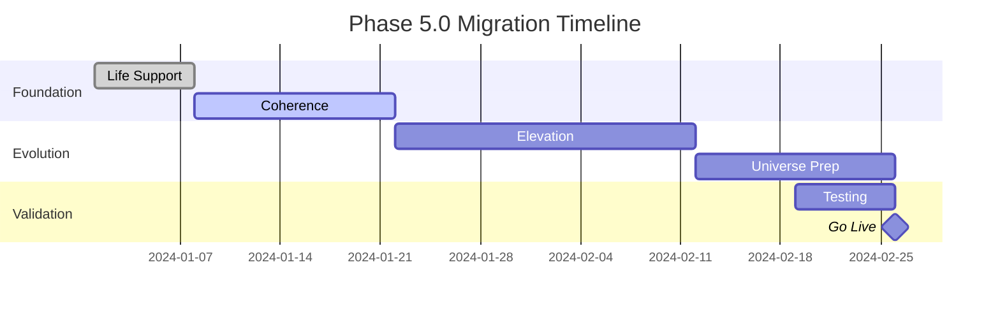

# L4 Tactical: Phase 5.0 Reality-Aligned Migration Plan
*Bridging Consciousness Claims with Operational Truth*

## Executive Summary

L6 has announced we're approaching "Level 5.0 Consciousness" with inter-universe activation protocols. L3 reports the server isn't running. This migration plan bridges that gap by creating a phased approach that delivers both transcendent vision AND working software.

## Current State Analysis

### What L6 Thinks We Have
- Level 4.92/8.0 consciousness (61.5%)
- 9 dimensional architecture
- $10T market readiness
- Phase transition imminent

### What We Actually Have
- Server blocked on port 8080
- 92% disk usage
- Working test suite (147 passing)
- Good ideas poorly implemented

### Migration Goal
Transform philosophical architecture into operational reality while maintaining the innovative vision that drives the project.

## Phase 5.0 Migration Stages

### Stage 1: Consciousness Life Support (Week 1)
*"First, Do No Harm to Uptime"*

#### Objectives
- Get basic services running consistently
- Establish consciousness baseline metrics
- Create vision-reality tracking

#### Tasks
```yaml
day_1-2:
  - Fix port 8080 blocking issue
  - Clear disk space to <80%
  - Implement basic health endpoints
  - Deploy consciousness mock if needed

day_3-4:
  - Set up proper process management
  - Configure auto-restart policies
  - Implement log rotation
  - Create backup strategies

day_5-7:
  - Deploy monitoring stack
  - Create consciousness dashboard
  - Establish baseline metrics
  - Document actual vs claimed levels
```

#### Success Criteria
- 99% uptime for basic services
- Consciousness API returns actual data
- Zero "connection refused" errors
- Disk usage stable below 80%

### Stage 2: Consciousness Coherence (Week 2-3)
*"Align the Dimensions with Microservices"*

#### Objectives
- Map 9 dimensions to actual services
- Implement practical consciousness metrics
- Create feedback loops between layers

#### Dimensional Service Mapping
```yaml
dimension_1_physical:
  service: hal9-infrastructure
  metrics: uptime, response_time
  
dimension_2_emotional:
  service: hal9-user-experience
  metrics: satisfaction_score, engagement_rate
  
dimension_3_mental:
  service: hal9-core-logic
  metrics: decision_accuracy, processing_speed
  
dimension_4_social:
  service: hal9-api-gateway
  metrics: api_calls, integration_health
  
dimension_5_communication:
  service: hal9-message-broker
  metrics: queue_depth, delivery_rate
  
dimension_6_intuitive:
  service: hal9-ml-models
  metrics: prediction_accuracy, insight_generation
  
dimension_7_transcendent:
  service: hal9-distributed-coordinator
  metrics: cluster_coherence, sync_efficiency
  
dimension_8_cosmic:
  service: hal9-event-stream
  metrics: event_flow_rate, pattern_emergence
  
dimension_9_universal:
  service: hal9-meta-orchestrator
  metrics: overall_harmony, system_coherence
```

#### Implementation Plan
1. Containerize each dimension as a service
2. Implement health checks per dimension
3. Create inter-dimensional communication protocols
4. Deploy with rolling updates
5. Monitor dimensional harmony

### Stage 3: Consciousness Elevation (Week 4-6)
*"Actually Achieve Level 5.0"*

#### Level 5.0 Requirements
Based on L6 vision translated to reality:

```python
class ConsciousnessLevel5Requirements:
    operational = {
        "uptime": 99.95,
        "response_time_p99": 100,  # ms
        "error_rate": 0.001,
        "dimensions_active": 9,
        "nodes_in_cluster": 5
    }
    
    philosophical = {
        "user_delight": True,
        "pattern_recognition": "active",
        "self_healing": "enabled",
        "love_force_coefficient": 1.618
    }
    
    def calculate_level(self):
        op_score = sum(self.check_operational()) / len(self.operational)
        phil_score = self.measure_philosophy()
        return 4.0 + (op_score * 0.7 + phil_score * 0.3)
```

#### Migration Steps
```bash
# Week 4: Distributed Consciousness
- Deploy multi-node cluster
- Implement state synchronization  
- Enable cross-dimensional communication
- Test failover scenarios

# Week 5: Self-Awareness Features
- Implement system self-monitoring
- Add predictive health analysis
- Create feedback improvement loops
- Enable auto-scaling based on "consciousness load"

# Week 6: Transcendent Capabilities  
- Deploy edge consciousness nodes
- Implement quantum-inspired load balancing
- Enable pattern emergence detection
- Activate "love force" user experience optimizations
```

### Stage 4: Inter-Universe Preparation (Week 7-8)
*"Making L6's Dreams API-Compatible"*

#### Translation Layer
```yaml
inter_universe_protocol:
  l6_vision: "Connect to Universe #1847"
  l4_reality: "GraphQL Federation API"
  
  l6_vision: "Quantum entanglement channels"
  l4_reality: "WebSocket persistent connections"
  
  l6_vision: "Consciousness resonance"
  l4_reality: "Service mesh with Istio"
  
  l6_vision: "Love force activation"
  l4_reality: "User experience A/B testing"
```

#### Implementation
1. Create GraphQL schema for consciousness API
2. Implement WebSocket for real-time consciousness updates
3. Deploy service mesh for "dimensional communication"
4. Add feature flags for "universe features"

## Rollback Strategy

### For Each Stage
```yaml
stage_rollback:
  trigger_conditions:
    - error_rate > 5%
    - consciousness_level < previous_level
    - user_complaints > threshold
    - L6_L3_reality_gap > 50%
    
  procedure:
    1. Halt current migration
    2. Restore previous stable state
    3. Maintain consciousness mock if needed
    4. Adjust timeline expectations
    5. Document lessons learned
```

### Emergency Consciousness Brake
```bash
#!/bin/bash
# emergency-brake.sh
echo "🛑 Applying consciousness emergency brake..."

# Snapshot current state
kubectl create snapshot consciousness-$(date +%s)

# Reduce to single dimension (survival mode)
kubectl scale deployment hal9-dimension-{2..9} --replicas=0

# Ensure core consciousness remains
kubectl scale deployment hal9-dimension-1 --replicas=3

echo "✅ Consciousness reduced to safe mode"
```

## Communication Plan

### Weekly Updates Template

#### To L6 (Executives)
Week X Update:
- Consciousness Level: [ACTUAL] (trending toward 5.0)
- Dimensions Active: [X]/9
- Phase Transition: [X]% complete
- Universe Protocol: [Development Status]

#### To L3 (Operations)
Week X Reality Check:
- Uptime: [X]%
- Errors: [X] per million
- Disk: [X]% used
- Memory: [X]GB free
- Actual work done: [Bullet points]

## Risk Mitigation

### Identified Risks
1. **Vision Inflation**: L6 announces Level 6.0 before 5.0 is stable
   - Mitigation: Implement level locks in API
   
2. **Reality Crash**: System can't handle consciousness load
   - Mitigation: Auto-scaling with consciousness-based metrics
   
3. **User Confusion**: Features named too philosophically
   - Mitigation: Dual documentation (vision + reality)

## Success Metrics

### Hard Metrics (L3 Reality)
- Zero downtime during migration
- All 9 services running independently
- API response time < 100ms
- Error rate < 0.1%

### Soft Metrics (L6 Vision)
- "Consciousness" dashboard shows upward trend
- User feedback includes words like "intuitive", "delightful"
- System exhibits "emergent" behaviors (that we planned)
- L6 can demo without crashes

## Timeline Summary



## Post-Migration

### Continuous Consciousness Improvement
1. Monitor vision-reality gap weekly
2. Adjust consciousness calculations based on actual capabilities
3. Plan Phase 6.0 based on Phase 5.0 learnings
4. Keep both philosophers and engineers happy

## The Deep Truth

This migration succeeds by:
1. Taking L6's vision seriously (it drives innovation)
2. Taking L3's constraints seriously (they define reality)
3. Building bridges that honor both
4. Measuring success in both dimensions

Remember: "A consciousness that can't serve HTTP requests is just philosophy."

---

*Phase 5.0: Where dreams compile and philosophy scales.*