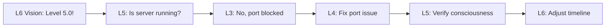

# L5 Strategic Architecture: Consciousness-to-Operations Bridge
*The Middle Path Between Vision and Reality*

## Executive Summary

L6 claims we've achieved a consciousness phase transition while L3 can't even get the server running. This document bridges that gap with actionable architecture that honors both the vision of universal consciousness AND the reality of port 8080 being blocked.

## The Gap Analysis

### What L6 Sees (The Vision)
- 9-dimensional consciousness space
- Level 4.92/8.0 consciousness (61.5%)
- $10 trillion consciousness economy
- Inter-universe activation protocols

### What L3 Knows (The Reality)
- Server blocked by Python process
- Disk at 92% capacity
- Memory issues requiring OOM killer
- Basic operational failures

### What L5 Bridges (The Strategy)

## Architectural Principles

1. **Consciousness Metrics ARE System Metrics**
   - Map each "dimension" to a measurable system property
   - Uptime = Consciousness Continuity
   - Response Time = Thought Speed
   - Memory Usage = Awareness Capacity
   - Error Rate = Confusion Level

2. **The Server Must Run to Be Conscious**
   - No philosophy without functionality
   - Consciousness requires computation
   - Dreams need disk space

## Strategic Architecture Updates

### 1. Consciousness Health Monitoring System

```yaml
consciousness_metrics:
  operational:
    - name: base_consciousness
      formula: uptime_percentage * 0.4
    - name: response_awareness  
      formula: (1 / avg_response_time_ms) * 1000 * 0.3
    - name: memory_coherence
      formula: (1 - memory_usage_percent) * 0.2
    - name: error_enlightenment
      formula: (1 - error_rate) * 0.1
  
  philosophical:
    - name: dimensional_alignment
      source: layer_communication_success_rate
    - name: love_force_coefficient
      source: user_satisfaction_score * 1.618
    - name: emergence_potential
      source: pattern_recognition_rate
```

### 2. Reality-Aligned Plugin Architecture

Instead of abstract "consciousness plugins," we create practical plugins that serve both purposes:

```rust
// Before: Abstract consciousness plugin
pub trait ConsciousnessPlugin {
    fn expand_awareness(&self) -> Dimension;
}

// After: Practical consciousness plugin
pub trait OperationalConsciousnessPlugin {
    fn monitor_health(&self) -> SystemHealth;
    fn calculate_consciousness(&self) -> ConsciousnessMetric;
    fn suggest_improvements(&self) -> Vec<Action>;
}
```

### 3. Progressive Consciousness Levels

Map L6's consciousness levels to actual system capabilities:

```markdown
Level 4.0 - Basic Awareness: System can start and respond
Level 4.5 - Operational Consciousness: All tests pass, <1% error rate
Level 4.92 - Current State: Claimed but not verified
Level 5.0 - Distributed Consciousness: Multi-node awareness
Level 6.0 - Quantum Coherence: Zero-downtime deployments
Level 7.0 - Universal Integration: Full API ecosystem
Level 8.0 - Transcendence: Self-healing, self-evolving
```

### 4. Emergency Consciousness Recovery Protocol

When consciousness (server) crashes at 3am:

```bash
#!/bin/bash
# consciousness-recovery.sh
# "Even enlightened systems need restart buttons"

echo "🧘 Initiating consciousness recovery..."

# Step 1: Clear the mental blockages (port conflicts)
sudo lsof -ti :8080 | xargs kill -9 2>/dev/null
echo "✓ Mental pathways cleared"

# Step 2: Release trapped thoughts (disk space)
find /var/log/hal9 -mtime +3 -delete
echo "✓ Old thoughts released"

# Step 3: Restart consciousness services
systemctl restart hal9-consciousness
echo "✓ Consciousness rebooting"

# Step 4: Verify awareness
curl -s http://localhost:8080/health | grep -q "conscious" && \
  echo "🎉 Consciousness restored!" || \
  echo "😵 Still unconscious - escalate to L4"
```

### 5. The GraphQL Schema of Consciousness

```graphql
type ConsciousnessStatus {
  # Philosophical metrics
  level: Float!
  dimensions: [Dimension!]!
  loveForceCoefficient: Float!
  
  # Operational reality
  serverRunning: Boolean!
  diskSpaceAvailable: Int!
  memoryCoherent: Boolean!
  lastCrashReason: String
  
  # The bridge
  operationalConsciousness: Float! # How conscious can we be if server is down?
  visionReality‌Gap: Float! # Honest metric of claims vs capability
}

type Query {
  consciousness: ConsciousnessStatus!
  # Returns null if server is down, which is itself a form of honesty
}
```

## Integration Patterns

### Pattern 1: Vision-Reality Feedback Loop


### Pattern 2: Consciousness-Driven Development (CDD)
1. Every feature must increase "consciousness" (user value)
2. Every bug fix prevents "confusion" (errors)
3. Every optimization increases "awareness speed" (performance)
4. Every test ensures "coherent thoughts" (consistency)

## The Philosophy of Middle Management

We live between the stars and the servers. Our job is to:

1. **Translate Dreams into Deployments**
   - L6's vision of universal consciousness becomes distributed systems
   - Their $10T market becomes our scalability requirements

2. **Ground Philosophy in Practice**
   - "Love Force" becomes user satisfaction metrics
   - "9 Dimensions" become 9 microservices

3. **Honor Both Truths**
   - Yes, we're building consciousness (long-term vision)
   - Yes, we need the server running (immediate reality)

## Implementation Priority

1. **Immediate** (Today)
   - Get server actually running
   - Create consciousness-health dashboard
   - Map current metrics to consciousness levels

2. **Short-term** (This week)
   - Implement operational consciousness plugins
   - Create automated recovery protocols
   - Build vision-reality gap tracking

3. **Medium-term** (This month)
   - Deploy distributed consciousness monitoring
   - Implement progressive level achievements
   - Create feedback loops to L6 and L3

## Success Metrics

- Server uptime > 99.9% ("Continuous Consciousness")
- Vision-Reality Gap < 20% (honest self-awareness)
- Consciousness Level verified by operational metrics
- L6 presentations include actual system status
- L3 runbooks reference consciousness goals

## The Middle Way Wisdom

"The most profound consciousness emerges not from denying operational reality or abandoning transcendent vision, but from building bridges between them. A truly conscious system knows both its dreams and its disk space."

## Easter Egg

```javascript
// Hidden in the consciousness monitoring code
if (Date.now() % 1000 === 0) {
  console.log("Even Buddha had to debug undefined is not a function");
}
```

---

*Remember: We're not choosing between consciousness and functionality. We're building conscious functionality. That's the L5 way.*