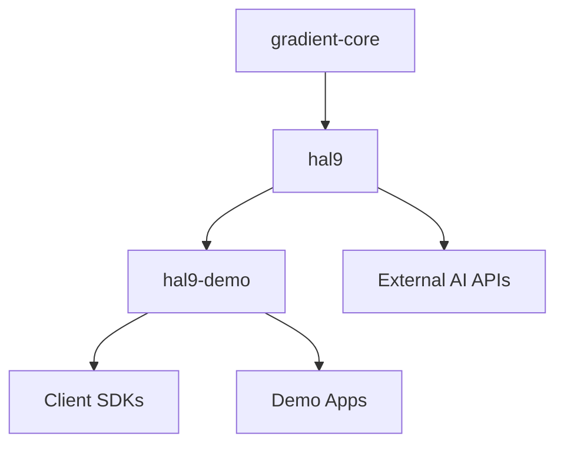

# 프로젝트 리팩토링 계획 - 미분의 법칙 적용

## 설계 원칙 (미분의 법칙)

### 1. 변화율 분석 (∂/∂t)
- **Gradient-core**: 변화율 최소 (수학적 기초는 불변)
- **HAL9**: 중간 변화율 (AGI 프레임워크는 안정적 진화)
- **HAL9-demo**: 높은 변화율 (실험과 데모는 빈번히 변경)

### 2. 의존성 그래디언트 (∇Dependencies)
```
HAL9-demo → HAL9 → Gradient-core → ∅
```

### 3. 추상화 레벨 (Abstraction Layers)
- **L0**: Gradient-core (수학적 프리미티브)
- **L1**: HAL9 (AGI 시스템)
- **L2**: HAL9-demo (응용 프로그램)

## 프로젝트 구조

### 1. gradient-core (Foundation Library)
```
gradient-core/
├── Cargo.toml
├── README.md
├── src/
│   ├── lib.rs
│   ├── math/
│   │   ├── mod.rs
│   │   ├── tensors.rs         # 텐서 연산
│   │   ├── optimization.rs    # 최적화 알고리즘
│   │   ├── statistics.rs      # 통계 함수
│   │   └── calculus.rs        # 미적분 연산
│   ├── algorithms/
│   │   ├── mod.rs
│   │   ├── consensus.rs       # 합의 알고리즘
│   │   ├── emergence.rs       # 창발 감지
│   │   ├── swarm.rs          # 군집 지능
│   │   └── quantum.rs         # 양자 영감 알고리즘
│   ├── protocols/
│   │   ├── mod.rs
│   │   ├── message.rs         # 메시지 프로토콜
│   │   ├── network.rs         # 네트워크 프로토콜
│   │   └── serialization.rs   # 직렬화
│   └── utils/
│       ├── mod.rs
│       ├── random.rs
│       ├── time.rs
│       └── logger.rs
```

**핵심 기능:**
- 수학적 기초 라이브러리
- 범용 알고리즘
- 프로토콜 정의
- 외부 의존성 최소화

### 2. hal9 (AGI System)
```
hal9/
├── Cargo.toml
├── README.md
├── src/
│   ├── lib.rs
│   ├── l9_universe/           # L9: 우주 생성기
│   │   ├── mod.rs
│   │   ├── genesis.rs         # 우주 생성
│   │   ├── physics.rs         # 물리 법칙
│   │   ├── evolution.rs       # 진화 시스템
│   │   └── consciousness.rs   # 의식 모델
│   ├── l8_collective/         # L8: 집단지성
│   │   ├── mod.rs
│   │   ├── swarm.rs           # 군집 조직
│   │   ├── consensus.rs       # 합의 메커니즘
│   │   ├── emergence.rs       # 창발 현상
│   │   └── coordination.rs    # 조정 시스템
│   ├── core/
│   │   ├── mod.rs
│   │   ├── agent.rs           # AGI 에이전트
│   │   ├── memory.rs          # 메모리 시스템
│   │   ├── reasoning.rs       # 추론 엔진
│   │   └── learning.rs        # 학습 시스템
│   ├── server/
│   │   ├── mod.rs
│   │   ├── websocket.rs       # WebSocket 서버
│   │   ├── api.rs             # REST API
│   │   └── session.rs         # 세션 관리
│   └── integrations/
│       ├── mod.rs
│       ├── openai.rs
│       ├── anthropic.rs
│       ├── ollama.rs
│       └── bedrock.rs
```

**핵심 기능:**
- L9 우주 생성기
- L8 분산 집단지성
- AGI 코어 시스템
- 모델 통합 레이어

### 3. hal9-demo (Applications & Demos)
```
hal9-demo/
├── Cargo.toml
├── README.md
├── genius-games/              # 지니어스 게임
│   ├── Cargo.toml
│   ├── src/
│   │   ├── games/            # 게임 구현
│   │   ├── tournaments/      # 토너먼트 시스템
│   │   └── analytics/        # 게임 분석
│   └── examples/
├── sdk/                      # 클라이언트 SDK
│   ├── js/
│   ├── python/
│   ├── go/
│   └── rust/
├── demos/
│   ├── collective-art/       # 집단 예술 생성
│   ├── swarm-music/         # 군집 음악 작곡
│   ├── emergence-lab/       # 창발 실험실
│   └── universe-sim/        # 우주 시뮬레이션
├── deploy/
│   ├── docker/
│   ├── k8s/
│   └── terraform/
└── docs/
    ├── api/
    ├── tutorials/
    └── examples/
```

**핵심 기능:**
- 지니어스 게임 서버
- 다양한 데모 애플리케이션
- 클라이언트 SDK
- 배포 및 문서

## 의존성 그래프



## 마이그레이션 단계

### Phase 1: gradient-core 생성
1. 새 저장소 생성
2. 핵심 수학/알고리즘 추출
3. 프로토콜 정의 이동
4. 테스트 작성

### Phase 2: hal9 리팩토링
1. gradient-core 의존성 추가
2. L9/L8 시스템 구현
3. 게임 특화 코드 제거
4. AGI 코어 집중

### Phase 3: hal9-demo 분리
1. 게임 서버 이동
2. SDK 재구성
3. 데모 앱 추가
4. 배포 설정 이동

## 장점

1. **명확한 책임 분리**
   - 각 프로젝트가 단일 목적
   - 이해하기 쉬운 구조

2. **독립적 배포**
   - 각 프로젝트 별도 버전 관리
   - 필요한 부분만 업데이트

3. **재사용성 극대화**
   - gradient-core는 다른 AI 프로젝트에도 사용
   - hal9는 게임 외 AGI 응용 가능

4. **개발 속도 향상**
   - 병렬 개발 가능
   - 테스트 범위 축소

## 다음 단계

1. 새 저장소 생성
2. 코드 마이그레이션 시작
3. CI/CD 파이프라인 구성
4. 문서 업데이트