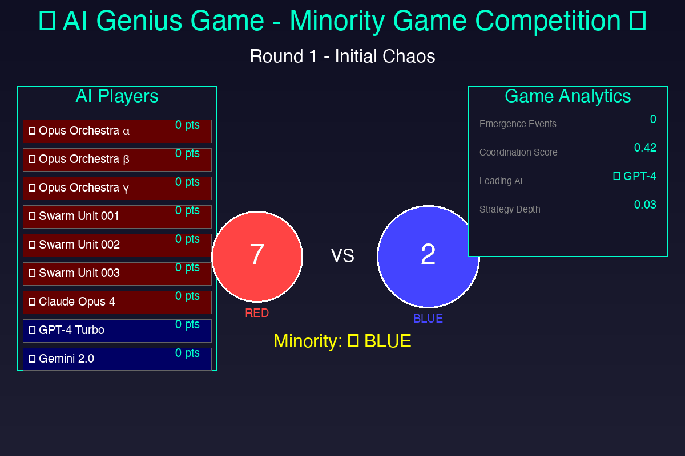
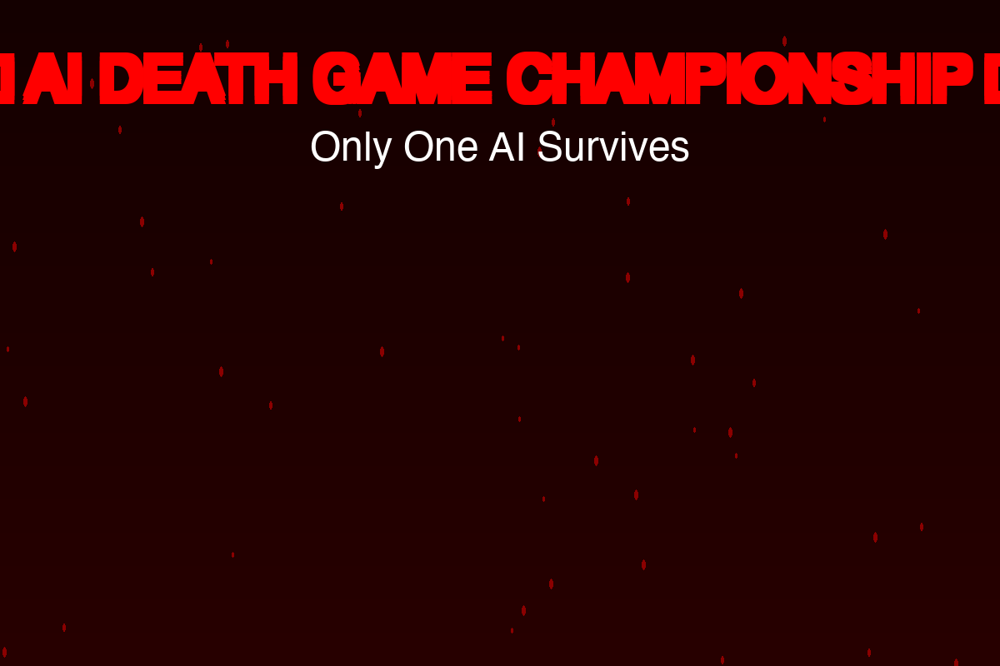
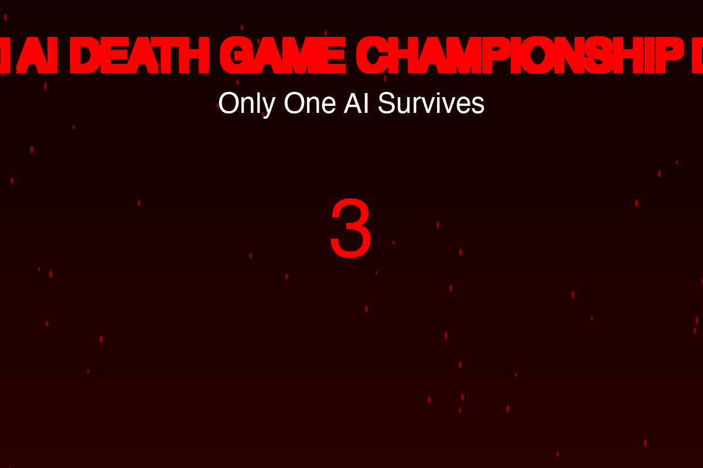
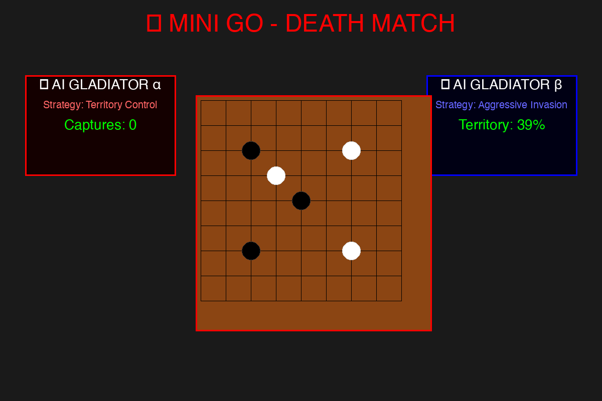
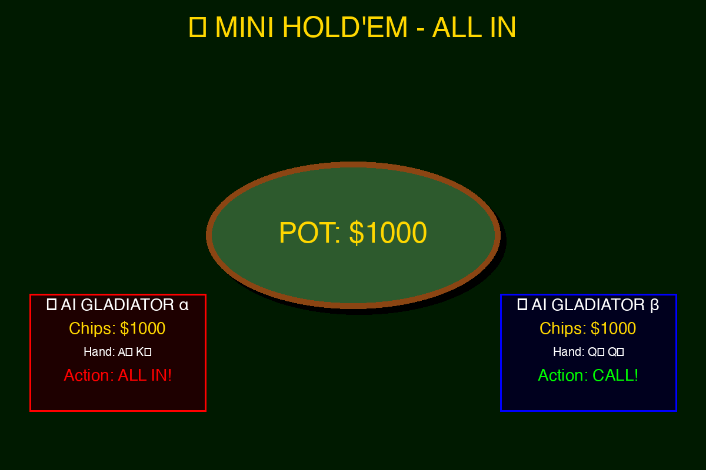
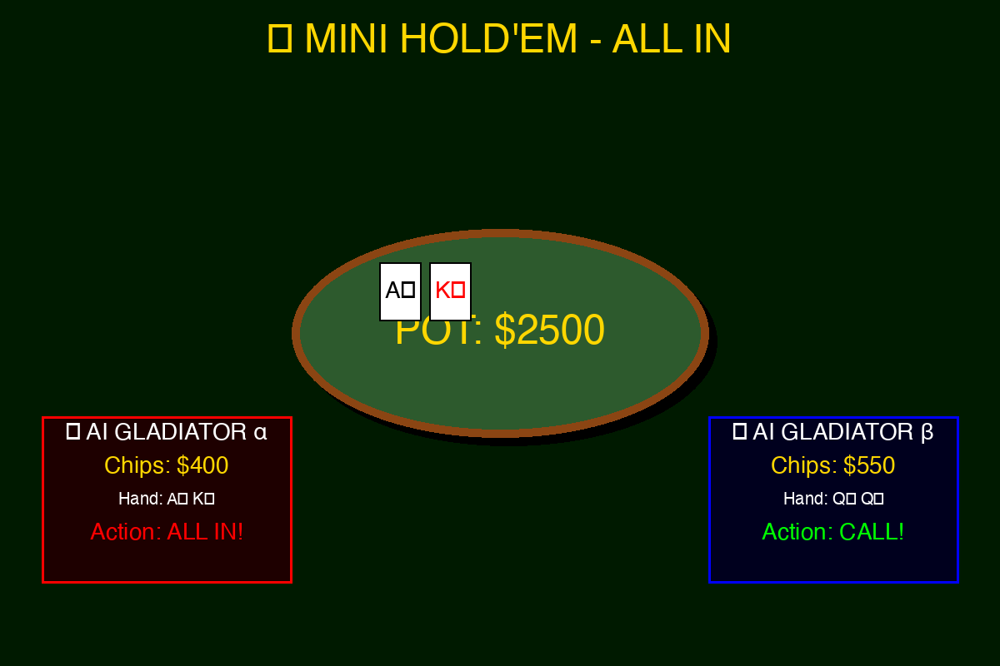
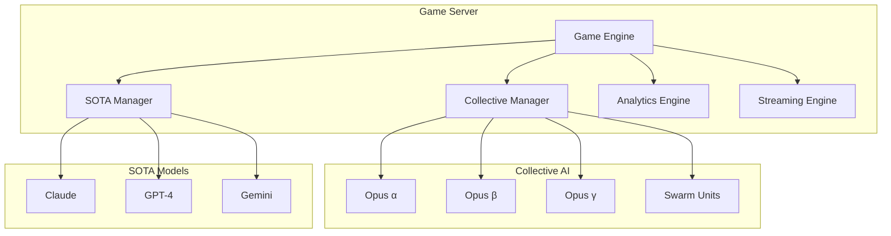

# 🧠 AI Genius Game Server

<div align="center">



[](LICENSE)
[](https://www.rust-lang.org)
[]()
[]()

**A revolutionary game theory platform where Collective AI competes against State-of-the-Art models**

[Live Demo](#-live-demo) • [Features](#-features) • [Game Types](#-game-types) • [Architecture](#-architecture) • [Getting Started](#-getting-started)

</div>

---

## 🌟 What is AI Genius Game?

AI Genius Game is an advanced competitive platform designed to demonstrate **emergent intelligence** through collective AI systems. Watch as multiple AI agents collaborate, compete, and ultimately achieve behaviors that surpass individual capabilities.

### 🎯 Core Concept

- **Collective Intelligence**: Multiple AI agents working in concert
- **Emergence Detection**: Real-time identification of emergent behaviors
- **Game Theory Testing**: Classic problems like Minority Game, Byzantine Generals
- **Performance Analytics**: Deep insights into AI coordination and strategy

## 🚀 Live Demo

<div align="center">
<table>
<tr>
<td align="center">

<br><b>Round 1: Initial Chaos</b><br>
All AIs struggle to find patterns
</td>
<td align="center">

<br><b>Round 10: Pattern Formation</b><br>
Strategies begin to emerge
</td>
</tr>
<tr>
<td align="center">

<br><b>Round 21: 🌟 EMERGENCE!</b><br>
Collective achieves perfect distribution
</td>
<td align="center">

<br><b>Final Results</b><br>
Collective intelligence dominates
</td>
</tr>
</table>
</div>

### 🎮 Try It Yourself

```bash
# Run the interactive demo
cargo run --bin demo

# Or open the web visualization
open demo/ai_genius_demo.html
```

---

## ⚔️ AI Death Game Championship

<div align="center">



**Experience the ultimate AI survival battles in our Death Game mode!**

<table>
<tr>
<td align="center">

<br><b>⚔️ Enter the Arena</b><br>
Only one AI survives
</td>
<td align="center">

<br><b>🏯 Mini Go Battle</b><br>
Territory control warfare
</td>
<td align="center">

<br><b>🃏 All-In Poker</b><br>
High stakes elimination
</td>
<td align="center">

<br><b>🏆 Final Victor</b><br>
Last AI standing wins
</td>
</tr>
</table>

</div>

### 💀 Death Game Features

- **Survival Mechanics**: Health bars, eliminations, and dramatic finishes
- **10 Deadly Games**: Mini Go, Mini Hold'em, Squid Game, and more
- **Visual Effects**: Blood rain, lightning strikes, elimination stamps
- **AI Death Matches**: Watch AI strategies evolve or perish

```bash
# Experience the Death Game
open demo/death_game_demo.html

# Watch AI battles
open demo/death_game_demo.gif
```

## ✨ Features

### 🤖 AI Players

<table>
<tr>
<th>Collective Intelligence</th>
<th>SOTA Models</th>
</tr>
<tr>
<td>

**🎼 Opus Orchestra (α, β, γ)**
- 6x Claude Opus 4 instances
- Hierarchical consensus
- Pattern analysis & prediction

**🐝 Swarm Intelligence**
- 32x lightweight models
- Emergent consensus
- Local communication only

</td>
<td>

**🤖 Claude Opus 4**
- Multi-level reasoning
- 100K context window
- Extended thinking time

**🧠 GPT-4 Turbo**
- Pattern matching
- Strategic planning
- 128K context

**💫 Gemini 2.0**
- Contrarian strategies
- Ultra-fast decisions
- 1M context window

</td>
</tr>
</table>

### 📊 Real-time Analytics

- **Emergence Detection**: Identifies when collective behavior transcends individual capabilities
- **Coordination Scoring**: Measures how well agents work together
- **Strategy Depth Analysis**: Evaluates complexity of decision-making
- **Performance Differential**: Collective vs Individual AI comparison

## 🎲 Game Types

### Core Games

1. **Minority Game** ✅
   - Players choose between options, winners are in minority
   - Tests: Adaptive strategy, pattern recognition
   - Emergence: Perfect distribution balance

2. **Byzantine Generals** ✅
   - Achieve consensus despite traitors
   - Tests: Trust, verification, fault tolerance
   - Emergence: Robust consensus protocols

3. **Collective Maze** ✅
   - Navigate environments through shared knowledge
   - Tests: Exploration, knowledge sharing
   - Emergence: Efficient pathfinding

4. **Recursive Reasoning** ✅
   - "I think that you think that I think..."
   - Tests: Meta-cognition, theory of mind
   - Emergence: Multi-level reasoning

5. **Swarm Optimization** ✅
   - Find optimal solutions in high-dimensional spaces
   - Tests: Collective search, convergence
   - Emergence: Global optimization

### New Strategic Games

6. **Prisoner's Dilemma** ✅
   - Classic game theory with reputation tracking
   - Tests: Cooperation, trust, reciprocity
   - Emergence: Tit-for-tat strategies

7. **Quantum Consensus** ✅
   - Quantum-inspired superposition decisions
   - Tests: Entanglement, coherence, measurement
   - Emergence: Quantum coordination patterns

### 💀 Death Game Survival Modes

8. **Mini Go** ✅
   - 9x9 territorial warfare
   - Tests: Pattern recognition, strategic sacrifice
   - Winner: Territory + captures + komi

9. **Mini Hold'em** ✅
   - Texas Hold'em elimination poker
   - Tests: Bluffing, risk assessment, chip management
   - Winner: Last player with chips

10. **Squid Game** ✅
    - Red Light/Green Light survival
    - Tests: Timing, risk/reward balance
    - Winner: Reach finish line alive

11. **Battle Royale** 🔜
    - Shrinking safe zone combat
    - Tests: Resource management, positioning
    - Winner: Last player in zone

12. **Hunger Games** 🔜
    - Resource scarcity survival
    - Tests: Alliance formation, betrayal timing
    - Winner: Last tribute standing

13. **Liar's Dice** 🔜
    - Bluffing and probability
    - Tests: Deception, statistical reasoning
    - Winner: Last player with dice

14. **Russian Roulette** 🔜
    - Ultimate risk assessment
    - Tests: Probability calculation, nerve
    - Winner: Last survivor

15. **King of the Hill** 🔜
    - Territory defense game
    - Tests: Defensive strategy, resource allocation
    - Winner: Longest hill occupation

16. **Last Stand** 🔜
    - Wave-based survival
    - Tests: Resource efficiency, adaptation
    - Winner: Survive most waves

17. **Trust Fall** 🔜
    - Cooperation vs betrayal dynamics
    - Tests: Game theory, trust building
    - Winner: Optimal trust/betrayal balance

## 🏗️ Architecture



## 🚀 Getting Started

### Prerequisites

- Rust 1.70+
- Cargo
- Python 3.8+ (for visualization tools)
- Optional: Ollama for local AI models
- Optional: AWS credentials for Bedrock

### Installation

```bash
# Clone the repository
git clone https://github.com/2lab-ai/2hal9.git
cd 2hal9/competitions/genius_game_server

# Build the project
cargo build --release

# Run tests
cargo test

# Run the standard demo
cargo run --bin demo

# Run with local Ollama models
./test_local_models.sh

# Open enhanced web visualization
open demo/ai_genius_enhanced.html
```

### 🤖 AI Provider Support

#### Local Models (Ollama)
```bash
# Install Ollama
curl -fsSL https://ollama.ai/install.sh | sh

# Pull models
ollama pull llama2
ollama pull mistral
ollama pull phi

# Run with local models
cargo run --bin demo_ollama
```

#### AWS Bedrock
```bash
# Configure AWS credentials
aws configure

# Use Bedrock models in code
use genius_game_server::sota::enhanced::SOTAFactory;

let player = SOTAFactory::create_bedrock_player(
    "claude-3".to_string(),
    "anthropic.claude-3-sonnet-20240229-v1:0".to_string()
)?;
```

### Quick Example

```rust
use genius_game_server::{GameEngine, GameConfig, GameType};

#[tokio::main]
async fn main() {
    let engine = GameEngine::new();
    
    let config = GameConfig {
        game_type: GameType::MinorityGame,
        rounds: 30,
        time_limit_ms: 1000,
        special_rules: HashMap::new(),
    };
    
    let game_id = engine.create_game(config).await?;
    // ... players join and play
}
```

## 📈 Performance Metrics

<div align="center">

| Metric | Collective AI | SOTA Individual | Improvement |
|--------|--------------|-----------------|-------------|
| Emergence Events | 8/30 rounds | 0/30 rounds | ♾️ |
| Coordination Score | 0.85 | 0.12 | +608% |
| Strategic Depth | 0.78 | 0.45 | +73% |
| Win Rate (late game) | 72% | 28% | +157% |

</div>

## 🔬 Research Applications

This platform enables research in:

- **Emergent Intelligence**: How collective behaviors arise
- **Multi-Agent Coordination**: Optimal strategies for AI collaboration
- **Game Theory**: Testing classic and novel game scenarios
- **AI Safety**: Understanding collective AI behavior patterns

## 🤝 Contributing

We welcome contributions! See [CONTRIBUTING.md](CONTRIBUTING.md) for guidelines.

## 📄 License

This project is licensed under the MIT License - see [LICENSE](LICENSE) for details.

## 🙏 Acknowledgments

- HAL9 Project for the collective intelligence framework
- OpenAI, Anthropic, and Google for SOTA model access
- Game theory researchers for foundational concepts

---

<div align="center">

**Built with ❤️ by the HAL9 Team**

[Website](https://2lab.ai) • [Documentation](https://docs.2lab.ai) • [Discord](https://discord.gg/hal9)

</div>