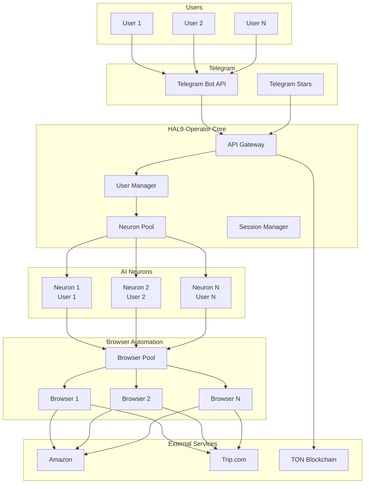
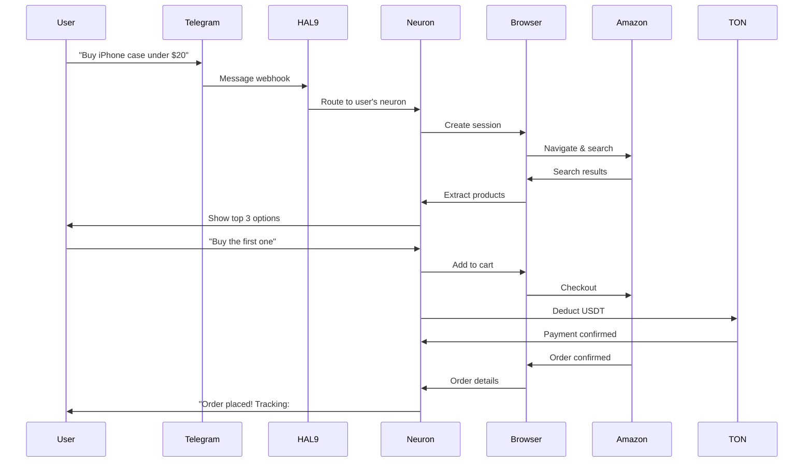
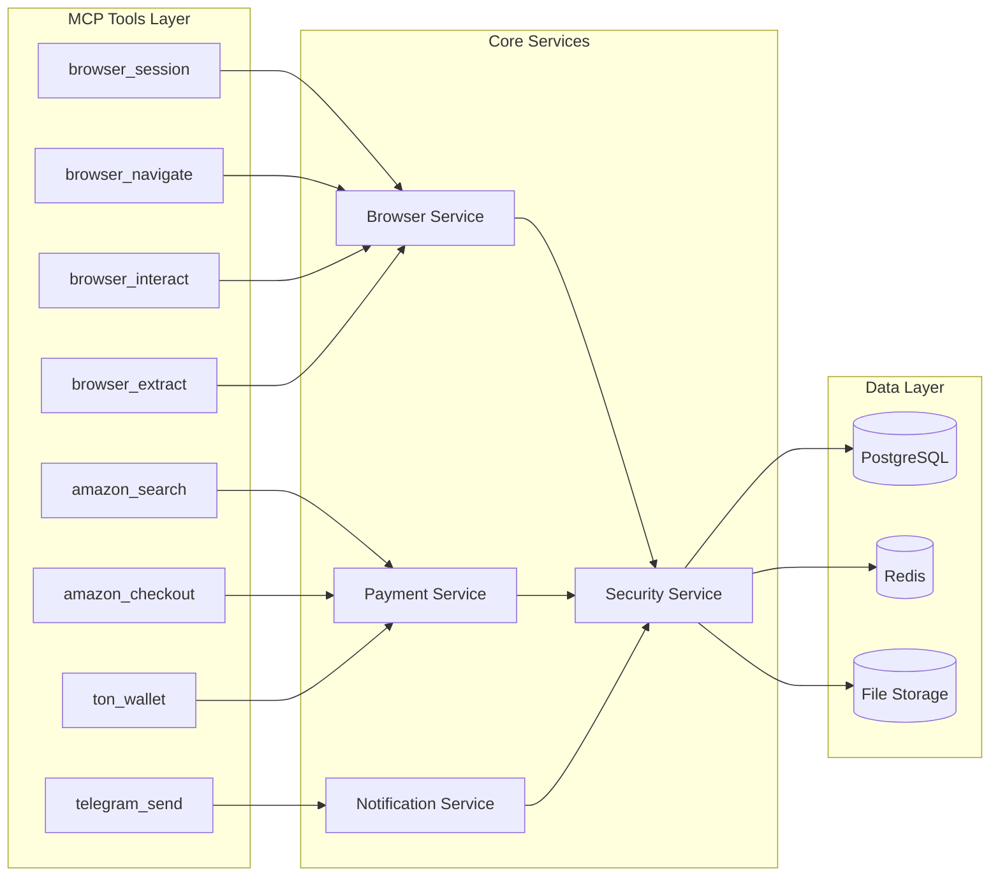
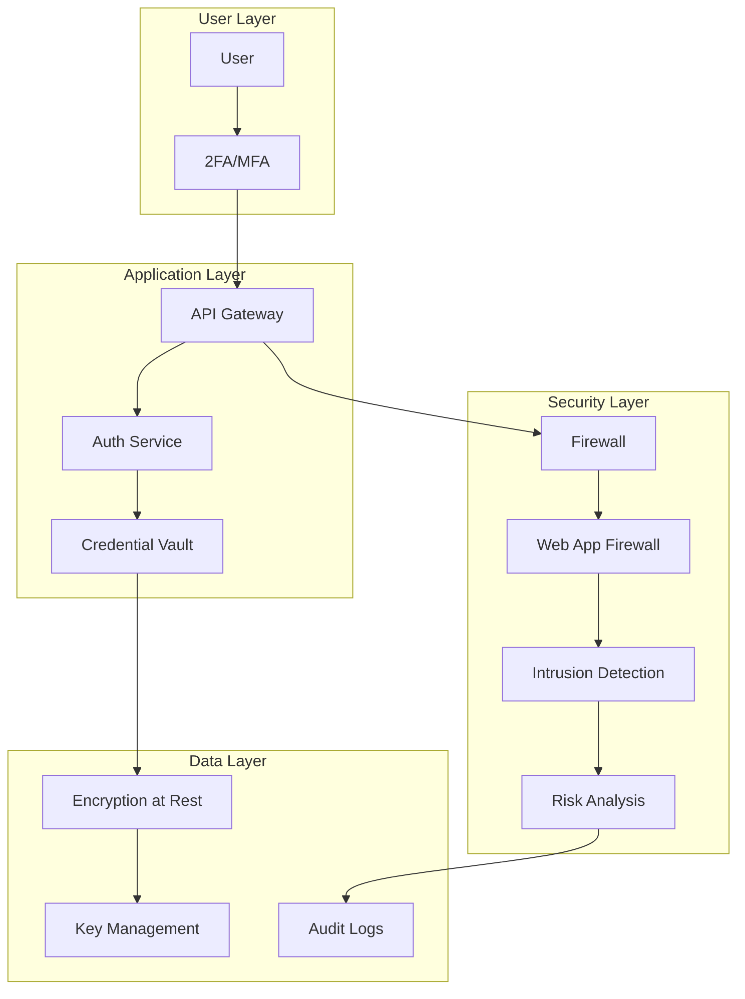
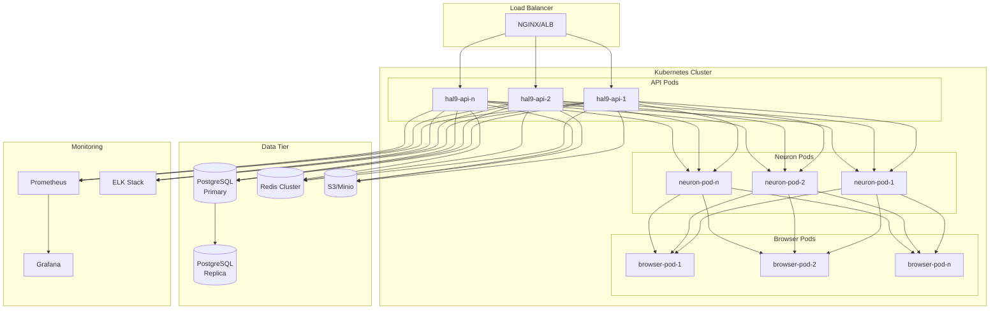
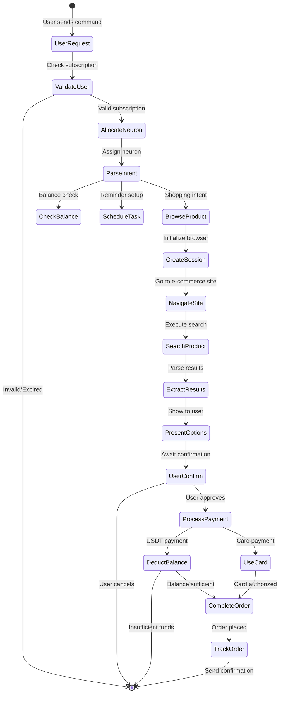
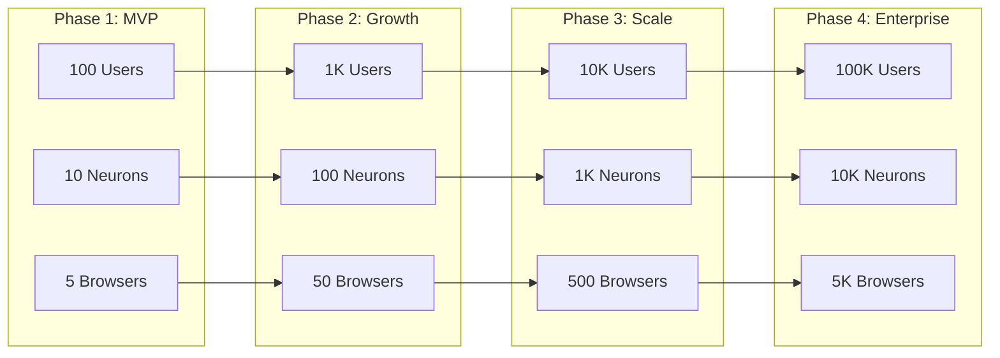
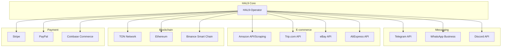

# HAL9-Operator Architecture Diagrams

## System Overview

## Data Flow Diagram

## Component Architecture

## Security Architecture

## Deployment Architecture

## Transaction Flow

## Scaling Strategy

## Integration Points

These diagrams provide a comprehensive visual overview of the HAL9-Operator architecture, showing how all components interact to deliver autonomous shopping and financial management capabilities through Telegram.