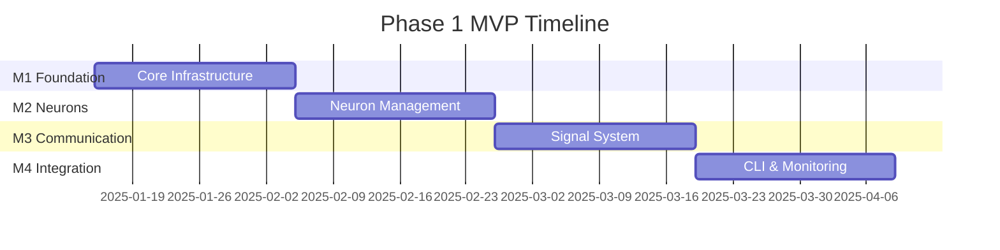

# Phase 1: MVP Milestones & Issues

**Timeline**: 3 months  
**Scope**: Single HAL9 server with CLI interface  
**Goal**: Demonstrate hierarchical AI neuron orchestration with local communication

## Milestone Overview

---

## Milestone 1: Core Infrastructure (Weeks 1-3)

### Objective
Establish the foundational Rust project structure and core abstractions.

### Issues

#### M1.1: Project Setup
- **Description**: Initialize Rust project with dependencies
- **Tasks**:
  - [ ] Create Cargo workspace structure
  - [ ] Add dependencies (tokio, serde, clap, etc.)
  - [ ] Setup logging with tracing
  - [ ] Configure build and test pipelines
- **Acceptance Criteria**: `cargo build` and `cargo test` work
- **Estimate**: 2 days

#### M1.2: Core Type Definitions
- **Description**: Implement core data structures from draft
- **Tasks**:
  - [ ] Define `NeuronSignal` struct
  - [ ] Define `PropagationType` enum
  - [ ] Define `SignalPayload` and related types
  - [ ] Implement serialization/deserialization
- **Acceptance Criteria**: Types serialize to/from JSON correctly
- **Estimate**: 3 days

#### M1.3: Configuration System
- **Description**: Implement configuration loading and validation
- **Tasks**:
  - [ ] Define `ServerConfig` structure
  - [ ] Define `NeuronConfig` structure
  - [ ] Implement YAML/JSON config loader
  - [ ] Add config validation
  - [ ] Create example configurations
- **Acceptance Criteria**: Can load and validate config files
- **Estimate**: 3 days

#### M1.4: Error Handling Framework
- **Description**: Setup comprehensive error handling
- **Tasks**:
  - [ ] Define custom error types
  - [ ] Implement error propagation with anyhow
  - [ ] Add error context helpers
  - [ ] Setup panic handlers
- **Acceptance Criteria**: All errors properly typed and logged
- **Estimate**: 2 days

---

## Milestone 2: Neuron Management (Weeks 4-6)

### Objective
Implement Claude neuron process spawning and management.

### Issues

#### M2.1: Claude Process Wrapper
- **Description**: Create abstraction for Claude CLI processes
- **Tasks**:
  - [ ] Implement process spawning with tokio::process
  - [ ] Setup STDIN/STDOUT pipes
  - [ ] Add environment variable injection
  - [ ] Handle process lifecycle
- **Acceptance Criteria**: Can spawn and communicate with Claude
- **Estimate**: 4 days

#### M2.2: Neuron Communication Channels
- **Description**: Implement async communication with neurons
- **Tasks**:
  - [ ] Create async STDIN writer task
  - [ ] Create async STDOUT reader task
  - [ ] Implement message framing/delimiting
  - [ ] Add timeout handling
- **Acceptance Criteria**: Reliable bidirectional communication
- **Estimate**: 3 days

#### M2.3: Neuron Registry
- **Description**: Track and manage active neurons
- **Tasks**:
  - [ ] Implement neuron registry with DashMap
  - [ ] Add neuron health monitoring
  - [ ] Implement neuron restart on failure
  - [ ] Add graceful shutdown
- **Acceptance Criteria**: Can track neuron state and restart failed neurons
- **Estimate**: 3 days

#### M2.4: Prompt Formatting
- **Description**: Convert signals to Claude prompts
- **Tasks**:
  - [ ] Design neuron prompt templates
  - [ ] Implement forward signal formatting
  - [ ] Implement backward signal formatting
  - [ ] Add layer-specific prompts
- **Acceptance Criteria**: Neurons understand and respond to signals
- **Estimate**: 2 days

---

## Milestone 3: Signal System (Weeks 7-9)

### Objective
Implement the neural signal routing and processing system.

### Issues

#### M3.1: Signal Queue
- **Description**: Implement async signal processing queue
- **Tasks**:
  - [ ] Create mpsc channel for signals
  - [ ] Implement signal processor task
  - [ ] Add signal prioritization
  - [ ] Handle backpressure
- **Acceptance Criteria**: Signals processed in order without loss
- **Estimate**: 3 days

#### M3.2: Local Routing
- **Description**: Route signals between local neurons
- **Tasks**:
  - [ ] Implement routing table
  - [ ] Add neuron connection mapping
  - [ ] Route signals based on configuration
  - [ ] Handle missing routes
- **Acceptance Criteria**: Signals correctly routed to target neurons
- **Estimate**: 3 days

#### M3.3: Forward Propagation
- **Description**: Implement task distribution down hierarchy
- **Tasks**:
  - [ ] Parse strategic directives (L4)
  - [ ] Distribute to design neurons (L3)
  - [ ] Fan out to implementation neurons (L2)
  - [ ] Collect execution results (L1)
- **Acceptance Criteria**: Tasks flow down hierarchy correctly
- **Estimate**: 4 days

#### M3.4: Backward Propagation
- **Description**: Implement error/gradient flow up hierarchy
- **Tasks**:
  - [ ] Detect execution failures
  - [ ] Generate gradient signals
  - [ ] Propagate errors upward
  - [ ] Implement adjustment logic
- **Acceptance Criteria**: Errors propagate and trigger adjustments
- **Estimate**: 4 days

---

## Milestone 4: CLI & Monitoring (Weeks 10-12)

### Objective
Create user interface and observability tools.

### Issues

#### M4.1: CLI Interface
- **Description**: Build command-line interface with clap
- **Tasks**:
  - [ ] Implement `start` command
  - [ ] Implement `status` command
  - [ ] Implement `signal` command for testing
  - [ ] Add configuration override flags
- **Acceptance Criteria**: Can control server via CLI
- **Estimate**: 3 days

#### M4.2: Interactive REPL
- **Description**: Create interactive command interface
- **Tasks**:
  - [ ] Build REPL loop
  - [ ] Add command history
  - [ ] Implement signal injection
  - [ ] Add neuron inspection
- **Acceptance Criteria**: Can interact with running system
- **Estimate**: 3 days

#### M4.3: Basic Monitoring
- **Description**: Implement system observability
- **Tasks**:
  - [ ] Track signal counts and latency
  - [ ] Monitor neuron health
  - [ ] Log signal flow
  - [ ] Add performance metrics
- **Acceptance Criteria**: Can observe system behavior
- **Estimate**: 3 days

#### M4.4: Demo Scenarios
- **Description**: Create demonstration workflows
- **Tasks**:
  - [ ] Simple forward propagation demo
  - [ ] Error handling demo
  - [ ] Multi-layer coordination demo
  - [ ] Performance benchmark
- **Acceptance Criteria**: Can demonstrate core capabilities
- **Estimate**: 3 days

---

## Development Guidelines

### Testing Strategy
- Unit tests for each component
- Integration tests for signal flow
- Mock Claude processes for testing
- Stress tests for queue handling

### Documentation
- Code documentation with rustdoc
- Architecture diagrams
- Configuration examples
- Troubleshooting guide

### Success Criteria
1. **Functional**: Can spawn 7 neurons in hierarchical configuration
2. **Performance**: Process 100+ signals/second
3. **Reliability**: Automatic recovery from neuron failures
4. **Usability**: Clear CLI interface and logs

---

## Risk Mitigation

### Technical Risks
1. **Claude CLI Integration**
   - Risk: Claude process behavior varies
   - Mitigation: Implement robust error handling and mocking

2. **Async Complexity**
   - Risk: Deadlocks or race conditions
   - Mitigation: Careful task design and extensive testing

3. **Memory Usage**
   - Risk: Memory leaks in long-running processes
   - Mitigation: Regular process recycling

### Schedule Risks
1. **Claude API Changes**
   - Risk: Claude interface changes
   - Mitigation: Abstract interface, version pinning

2. **Complexity Underestimation**
   - Risk: Signal routing more complex than expected
   - Mitigation: Start with simple cases, iterate

---

## Next Steps

After Phase 1 completion:
1. Performance optimization
2. Multi-server support preparation
3. Advanced learning mechanisms
4. Production hardening