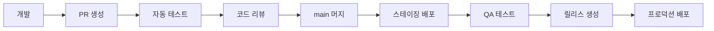

# HAL9 CI/CD 가이드

HAL9 프로젝트의 지속적 통합/배포 파이프라인 사용 가이드입니다.

## 📋 목차

1. [개요](#개요)
2. [GitHub Actions 워크플로우](#github-actions-워크플로우)
3. [배포 프로세스](#배포-프로세스)
4. [환경별 배포](#환경별-배포)
5. [롤백 절차](#롤백-절차)
6. [모니터링](#모니터링)
7. [문제 해결](#문제-해결)

## 🌟 개요

HAL9 CI/CD 파이프라인은 코드 품질 보장부터 프로덕션 배포까지 전체 소프트웨어 생명주기를 자동화합니다.

### 주요 기능

- ✅ 자동화된 코드 품질 검사 (formatting, linting)
- ✅ 다단계 테스트 (unit, integration, performance)
- ✅ Docker 이미지 자동 빌드 및 푸시
- ✅ 환경별 자동 배포 (staging, production)
- ✅ 성능 벤치마크 및 리포팅
- ✅ 보안 스캔 및 취약점 검사
- ✅ 자동 롤백 지원

## 🔄 GitHub Actions 워크플로우

### 1. CI/CD 메인 워크플로우 (`.github/workflows/ci-cd.yml`)

트리거:
- `main`, `develop` 브랜치 푸시
- Pull Request
- 릴리스 생성

주요 작업:
```yaml
jobs:
  lint        # 코드 포맷팅 및 린팅
  test        # 테스트 실행 (unit, integration, performance)
  build       # 바이너리 빌드
  docker      # Docker 이미지 빌드
  security    # 보안 스캔
  docs        # 문서 생성
  deploy      # 프로덕션 배포 (릴리스 시)
```

### 2. PR 체크 워크플로우 (`.github/workflows/pr-check.yml`)

Pull Request 시 자동 실행:
- PR 제목 형식 검증
- 변경된 파일에 따른 선택적 검사
- 자동 PR 코멘트 추가

### 3. 나이틀리 빌드 (`.github/workflows/nightly.yml`)

매일 새벽 2시 실행:
- Rust nightly 빌드 테스트
- 성능 벤치마크
- 메모리 및 리소스 분석
- 보안 취약점 스캔

## 🚀 배포 프로세스

### 개발 → 스테이징 → 프로덕션



### 자동 배포 트리거

1. **스테이징**: `main` 브랜치 푸시 시 자동
2. **프로덕션**: GitHub 릴리스 생성 시 자동

## 🌍 환경별 배포

### 스테이징 배포

```bash
# 수동 스테이징 배포
./layers/L3_operational/scripts/deploy/deploy-staging.sh v1.2.3

# Docker Compose 사용
docker compose -f docker-compose.staging.yml up -d
```

### 프로덕션 배포

```bash
# 프로덕션 배포 (Kubernetes)
./layers/L3_operational/scripts/deploy/deploy-production.sh v1.2.3

# 환경 변수 설정
export NAMESPACE=hal9-prod
export WEBHOOK_URL=https://hooks.slack.com/services/YOUR/WEBHOOK/URL
```

### 배포 전 체크리스트

- [ ] 모든 테스트 통과
- [ ] 성능 벤치마크 확인
- [ ] 보안 스캔 완료
- [ ] 데이터베이스 마이그레이션 준비
- [ ] 롤백 계획 수립

## ⏮️ 롤백 절차

### 긴급 롤백

```bash
# 즉시 이전 버전으로 롤백
./layers/L3_operational/scripts/deploy/rollback.sh

# 특정 리비전으로 롤백
kubectl rollout undo deployment/hal9 --to-revision=3 -n hal9-prod
```

### 롤백 후 조치

1. 인시던트 리포트 작성
2. 근본 원인 분석
3. 핫픽스 준비
4. 재배포 계획 수립

## 📊 모니터링

### 배포 상태 확인

```bash
# Kubernetes 배포 상태
kubectl rollout status deployment/hal9 -n hal9-prod

# 파드 상태 확인
kubectl get pods -n hal9-prod -l app=hal9

# 로그 확인
kubectl logs -f deployment/hal9 -n hal9-prod
```

### 성능 메트릭

- Response time < 500ms
- Error rate < 0.1%
- CPU usage < 80%
- Memory usage < 2GB

## 🔧 문제 해결

### 자주 발생하는 문제

#### 1. Docker 빌드 실패

```bash
# 캐시 정리 후 재빌드
docker system prune -af
docker compose build --no-cache
```

#### 2. 테스트 실패

```bash
# 로컬에서 테스트 재현
cargo test --workspace -- --nocapture
npm test -- --verbose
```

#### 3. 배포 실패

```bash
# 파드 이벤트 확인
kubectl describe pod <pod-name> -n hal9-prod

# 이전 배포 로그 확인
kubectl logs <pod-name> -n hal9-prod --previous
```

### 디버깅 명령어

```bash
# CI 환경 재현
act -j test  # GitHub Actions 로컬 실행

# 스테이징 환경 디버깅
docker compose -f docker-compose.staging.yml logs -f

# 프로덕션 환경 접속
kubectl exec -it <pod-name> -n hal9-prod -- /bin/bash
```

## 📝 CI/CD 설정 커스터마이징

### 환경 변수

```yaml
# .github/workflows/ci-cd.yml
env:
  RUST_VERSION: "1.75"  # Rust 버전
  DOCKER_REGISTRY: ghcr.io  # Docker 레지스트리
  IMAGE_NAME: ${{ github.repository }}  # 이미지 이름
```

### 시크릿 설정

GitHub 저장소 Settings → Secrets에서 설정:
- `WEBHOOK_URL`: Slack/Discord 알림 URL
- `DOCKERHUB_TOKEN`: Docker Hub 토큰 (필요시)
- `KUBECONFIG`: Kubernetes 설정 (base64 인코딩)

## 🚨 보안 고려사항

1. **시크릿 관리**
   - GitHub Secrets 사용
   - 환경별 시크릿 분리
   - 정기적 로테이션

2. **이미지 스캔**
   - Trivy 자동 스캔
   - CVE 데이터베이스 체크
   - 취약점 발견 시 빌드 실패

3. **접근 제어**
   - 프로덕션 배포는 승인 필요
   - RBAC 설정
   - 감사 로그 유지

## 📚 추가 리소스

- [GitHub Actions 문서](https://docs.github.com/en/actions)
- [Kubernetes 배포 가이드](https://kubernetes.io/docs/concepts/workloads/controllers/deployment/)
- [Docker 베스트 프랙티스](https://docs.docker.com/develop/dev-best-practices/)

---

문의사항이나 문제가 있으면 [이슈](https://github.com/2lab-ai/2hal9/issues)를 생성해주세요.