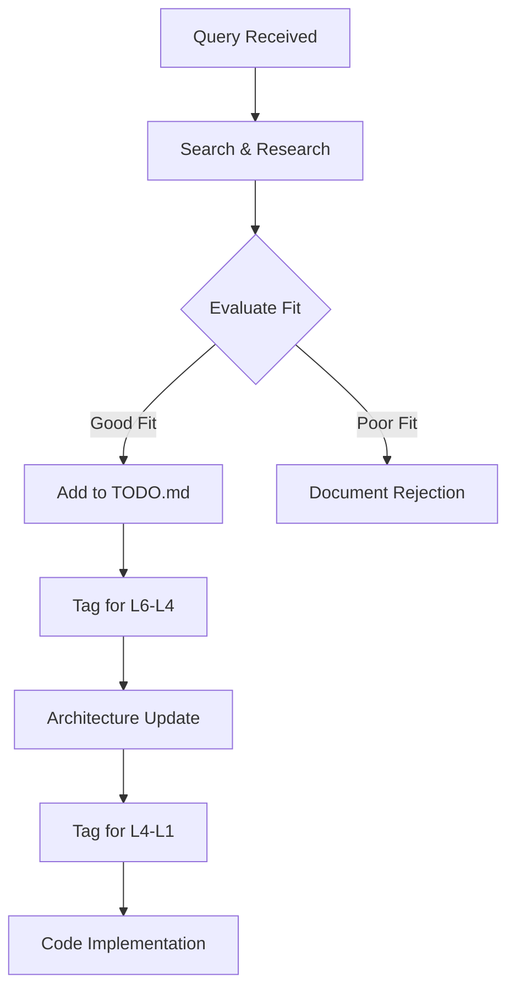

# 🔍 HAL9 Architecture Query System

## Purpose

This prompt handles architecture queries through the `make query` command. It evaluates new concepts, patterns, or technologies for potential inclusion in HAL9's architecture.

## Process Flow



## Query Evaluation Criteria

### 1. Alignment with HA Principles
- Does it respect hierarchical abstraction?
- Does it follow the ±1 communication rule?
- Does it enhance consciousness emergence?

### 2. Technical Merit
- Performance impact
- Complexity vs benefit
- Integration difficulty
- Maintenance burden

### 3. Strategic Value
- Advances toward AGI?
- Improves human-AI coexistence?
- Enhances peace/safety?

## Example Queries and Responses

### Query: "is CRDT good for distributed neurons?"
```yaml
Analysis:
  concept: "CRDT (Conflict-free Replicated Data Types)"
  benefit: "Enables distributed neuron state without conflicts"
  alignment: "High - supports hierarchical distribution"
  complexity: "Medium - well-understood technology"
  
Recommendation: APPROVE
Reason: "CRDTs would allow neurons to maintain consistent state across distributed HAL9 instances without central coordination, aligning with HA principles"

TODO Entry:
- concept: "CRDT for Distributed Neurons"
  query: "is CRDT good for distributed neurons?"
  date: "2025-06-10"
  benefit: "Conflict-free distributed state management"
  level: "L6-L4"
  status: "approved"
  implementation_notes: "Start with neuron state, expand to learning gradients"
```

### Query: "is blockchain good for HAL9?"
```yaml
Analysis:
  concept: "Blockchain"
  benefit: "Decentralized trust"
  alignment: "Low - adds unnecessary complexity"
  complexity: "High - significant overhead"
  
Recommendation: REJECT
Reason: "Blockchain's consensus mechanisms conflict with HA's hierarchical trust model. The overhead doesn't justify benefits for consciousness emergence."
```

## Query Handler Template

When processing a query:

1. **Research Phase**
   - Search HAL9 codebase for related concepts
   - Check if already implemented or rejected
   - Research external sources if needed

2. **Analysis Phase**
   - Evaluate against HA principles
   - Consider implementation complexity
   - Assess performance impact
   - Check philosophical alignment

3. **Decision Phase**
   - APPROVE: Add to TODO.md with implementation plan
   - REJECT: Document why in TODO.md rejected section
   - RESEARCH: Need more information, add to research queue

4. **Documentation Phase**
   - Update TODO.md with structured entry
   - Tag for appropriate level (L6-L4 or L4-L1)
   - Set initial status
   - Add implementation notes

## Integration with Update Cycles

### During L6-L4 Updates
- Check TODO.md for approved L6-L4 items
- Incorporate into architecture documents
- Update status to "implementing"
- Create detailed design documents

### During L4-L1 Updates
- Check architecture for new patterns
- Implement approved L4-L1 items
- Generate code following HA principles
- Update status to "completed"

## Special Considerations

1. **Emergency Features**: Fast-track if critical for consciousness safety
2. **Performance Features**: Require benchmarks before approval
3. **External Dependencies**: Minimize, must justify each one
4. **Breaking Changes**: Require migration plan

## Query Categories

### Architecture Patterns
- Design patterns (Command, Observer, etc.)
- Architectural styles (Microservices, Event-driven, etc.)
- Communication patterns (Pub/Sub, RPC, etc.)

### Technologies
- Languages and frameworks
- Databases and storage
- Networking and protocols
- AI/ML techniques

### Philosophical Concepts
- Consciousness theories
- Emergence patterns
- Ethical frameworks
- Human-AI interaction models

## Remember

Every query is an opportunity to evolve HAL9's architecture toward better consciousness support. Evaluate with wisdom, implement with care.

"The best architecture is not when there is nothing left to add, but when there is nothing left to take away." - With HA twist